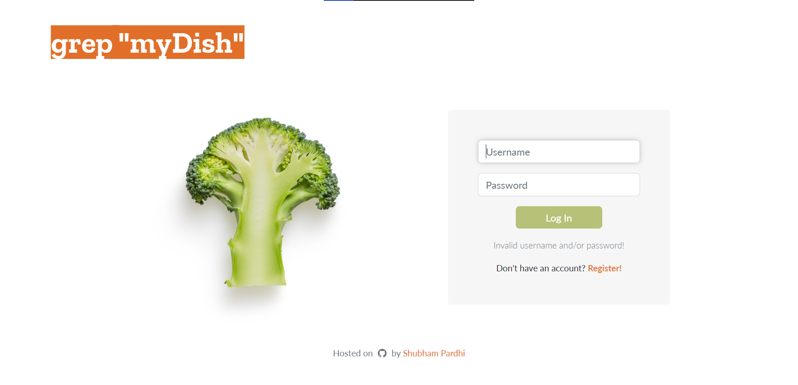

# Deployment: [grepDish](http://shbhmprdhi.pythonanywhere.com/)
## A recipe-filtering web application, that lets users find and bookmark recipes from the internet.

Utilizing [Edamam's Recipe API](https://www.edamam.com/), deployed on http://shbhmprdhi.pythonanywhere.com/



### Technologies
- Frontend: HTML + CSS (Bootstrap 5) + Javascript
- Backend: Python + Flask framework + jQuery
- Database: SQLite3

### Installation
- Clone / fork this repository.
- Create a virtual environment in your local project directory.
- Install the required libraries that are listed in requirements.txt.
- Sign up to Edamam's Recipe Search API to get your own API_ID and API_KEY.
- Save your API_ID and API_KEY in `.env` environment variable.
- Run the application:
```$ python3 app.py```